# Avi's graph-based validation test

`python3 test_validator.py`

## Explicit Connections (always)

Given exclusive cardinality relationships, we can infer that row-adjacency for
columns that have a direct hierarchical relationship should be linked.

e.g. given (C to-many B) and (B to-many A), we can say that:

| C | B | A | D |
|---|---|---|---|
| C1|B1 | A1| D1|

produces relationship (C1) <--- (B1) <--- (A1) but either _nothing_ for (D1) or
_everything_ for (D1)

## Implied Connections (optional)

Given exclusive cardinality relationships, we can infer that attachments
outside of the hierarchy are misplaced and should be propagated.

e.g. given (C to-many B) and (B to-many A), we can recover the following by
moving edge attachments to their place in the hierarchy.

* (A -> B) + (A -> C)  ==>  (A -> B -> C)
* (A -> C) + (B -> C)  ==>  (A -> B -> C)


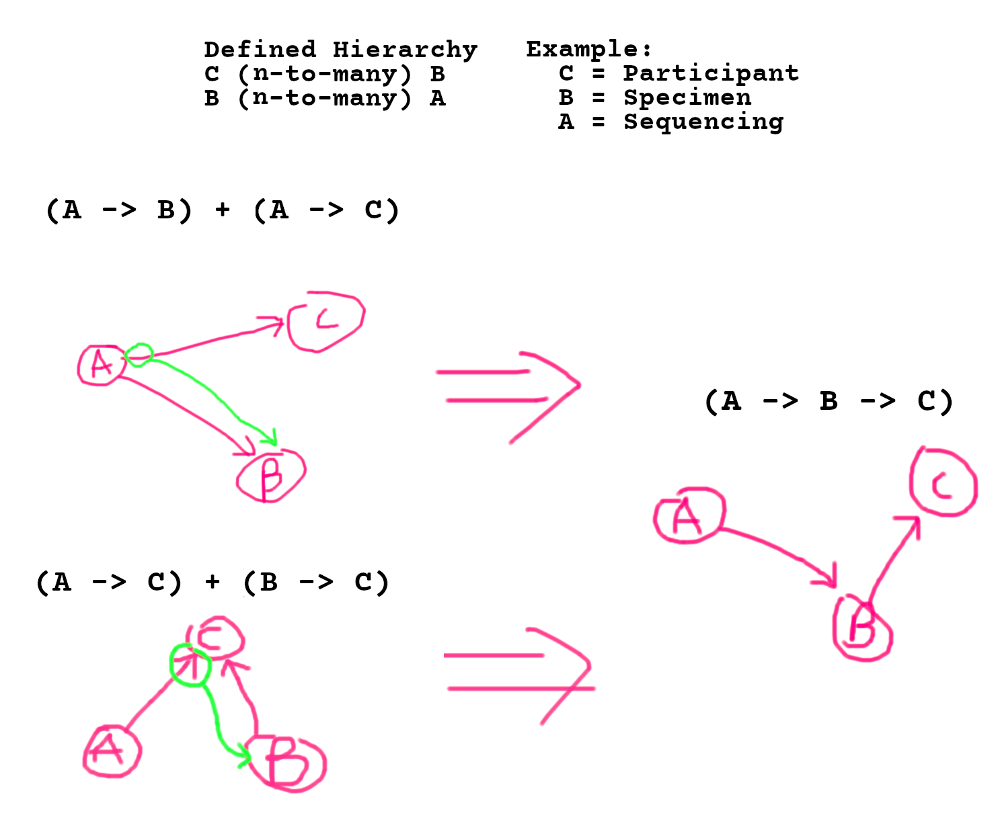

CURRENT RESULTS:

## DATASET1

```text
==========================================================================================
======================================== DATASET1 ========================================
==========================================================================================

NODE TYPE COUNTS:
	FAMILY|ID             : 7
	PARTICIPANT|ID        : 10
	BIOSPECIMEN|ID        : 11
	GENOMIC_FILE|URL_LIST : 5

Test: Each FAMILY|ID links to at least 1 PARTICIPANT|ID                         Result: ❌

Error Reasons:
	('FAMILY|ID', 'F12') -> []

Locations:
	('FAMILY|ID', 'F12') found in ['DATASET1/pf.csv']

~~~~~~~~~~~~~~~~~~~~~~~~~~~~~~~~~~~~~~~~~~~~~~~~~~~~~~~~~~~~~~~~~~~~~~~~~~~~~~~~~~~~~~~~~~

Test: Each PARTICIPANT|ID links to at least 1 FAMILY|ID                         Result: ❌

Error Reasons:
	('PARTICIPANT|ID', 'P11') -> []

Locations:
	('PARTICIPANT|ID', 'P11') found in ['DATASET1/pf.csv']

~~~~~~~~~~~~~~~~~~~~~~~~~~~~~~~~~~~~~~~~~~~~~~~~~~~~~~~~~~~~~~~~~~~~~~~~~~~~~~~~~~~~~~~~~~

Test: Each PARTICIPANT|ID links to at least 1 BIOSPECIMEN|ID                    Result: ❌

Error Reasons:
	('PARTICIPANT|ID', 'P11') -> []
	('PARTICIPANT|ID', 'P13') -> []

Locations:
	('PARTICIPANT|ID', 'P11') found in ['DATASET1/pf.csv']
	('PARTICIPANT|ID', 'P13') found in ['DATASET1/pf.csv']

~~~~~~~~~~~~~~~~~~~~~~~~~~~~~~~~~~~~~~~~~~~~~~~~~~~~~~~~~~~~~~~~~~~~~~~~~~~~~~~~~~~~~~~~~~

Test: Each BIOSPECIMEN|ID links to exactly 1 PARTICIPANT|ID                     Result: ❌

Error Reasons:
	('BIOSPECIMEN|ID', 'S2') -> [('PARTICIPANT|ID', 'P2'), ('PARTICIPANT|ID', 'P1')]
	('BIOSPECIMEN|ID', 'S8') -> []

Locations:
	('BIOSPECIMEN|ID', 'S2') found in ['DATASET1/sfp2.csv', 'DATASET1/spf.csv']
	('BIOSPECIMEN|ID', 'S8') found in ['DATASET1/spf.csv']
	('PARTICIPANT|ID', 'P1') found in ['DATASET1/spf.csv']
	('PARTICIPANT|ID', 'P2') found in ['DATASET1/sfp2.csv']

~~~~~~~~~~~~~~~~~~~~~~~~~~~~~~~~~~~~~~~~~~~~~~~~~~~~~~~~~~~~~~~~~~~~~~~~~~~~~~~~~~~~~~~~~~

Test: Each BIOSPECIMEN|ID links to at least 1 GENOMIC_FILE|URL_LIST             Result: ❌

Error Reasons:
	('BIOSPECIMEN|ID', 'S1') -> []
	('BIOSPECIMEN|ID', 'S2') -> []
	('BIOSPECIMEN|ID', 'S3') -> []
	('BIOSPECIMEN|ID', 'S4') -> []
	('BIOSPECIMEN|ID', 'S6') -> []
	('BIOSPECIMEN|ID', 'S8') -> []

Locations:
	('BIOSPECIMEN|ID', 'S1') found in ['DATASET1/spf.csv']
	('BIOSPECIMEN|ID', 'S2') found in ['DATASET1/sfp2.csv', 'DATASET1/spf.csv']
	('BIOSPECIMEN|ID', 'S3') found in ['DATASET1/spf.csv']
	('BIOSPECIMEN|ID', 'S4') found in ['DATASET1/spf.csv']
	('BIOSPECIMEN|ID', 'S6') found in ['DATASET1/spf.csv']
	('BIOSPECIMEN|ID', 'S8') found in ['DATASET1/spf.csv']

~~~~~~~~~~~~~~~~~~~~~~~~~~~~~~~~~~~~~~~~~~~~~~~~~~~~~~~~~~~~~~~~~~~~~~~~~~~~~~~~~~~~~~~~~~

Test: Each GENOMIC_FILE|URL_LIST links to exactly 1 BIOSPECIMEN|ID              Result: ✅

~~~~~~~~~~~~~~~~~~~~~~~~~~~~~~~~~~~~~~~~~~~~~~~~~~~~~~~~~~~~~~~~~~~~~~~~~~~~~~~~~~~~~~~~~~

Test: All resolved links are direct without gaps in hierarchy                   Result: ✅
```

### Input and output images...

DATASET1/input.png

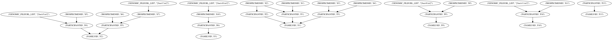

DATASET1/output.png

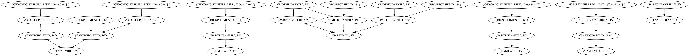


## DATASET2

```text
==========================================================================================
======================================== DATASET2 ========================================
==========================================================================================

NODE TYPE COUNTS:
	FAMILY|ID             : 3
	PARTICIPANT|ID        : 3
	BIOSPECIMEN|ID        : 3
	GENOMIC_FILE|URL_LIST : 3

Test: Each FAMILY|ID links to at least 1 PARTICIPANT|ID                         Result: ✅

~~~~~~~~~~~~~~~~~~~~~~~~~~~~~~~~~~~~~~~~~~~~~~~~~~~~~~~~~~~~~~~~~~~~~~~~~~~~~~~~~~~~~~~~~~

Test: Each PARTICIPANT|ID links to at least 1 FAMILY|ID                         Result: ✅

~~~~~~~~~~~~~~~~~~~~~~~~~~~~~~~~~~~~~~~~~~~~~~~~~~~~~~~~~~~~~~~~~~~~~~~~~~~~~~~~~~~~~~~~~~

Test: Each PARTICIPANT|ID links to at least 1 BIOSPECIMEN|ID                    Result: ✅

~~~~~~~~~~~~~~~~~~~~~~~~~~~~~~~~~~~~~~~~~~~~~~~~~~~~~~~~~~~~~~~~~~~~~~~~~~~~~~~~~~~~~~~~~~

Test: Each BIOSPECIMEN|ID links to exactly 1 PARTICIPANT|ID                     Result: ✅

~~~~~~~~~~~~~~~~~~~~~~~~~~~~~~~~~~~~~~~~~~~~~~~~~~~~~~~~~~~~~~~~~~~~~~~~~~~~~~~~~~~~~~~~~~

Test: Each BIOSPECIMEN|ID links to at least 1 GENOMIC_FILE|URL_LIST             Result: ✅

~~~~~~~~~~~~~~~~~~~~~~~~~~~~~~~~~~~~~~~~~~~~~~~~~~~~~~~~~~~~~~~~~~~~~~~~~~~~~~~~~~~~~~~~~~

Test: Each GENOMIC_FILE|URL_LIST links to exactly 1 BIOSPECIMEN|ID              Result: ✅

~~~~~~~~~~~~~~~~~~~~~~~~~~~~~~~~~~~~~~~~~~~~~~~~~~~~~~~~~~~~~~~~~~~~~~~~~~~~~~~~~~~~~~~~~~

Test: All resolved links are direct without gaps in hierarchy                   Result: ✅
```

### Input and output images...

DATASET2/input.png

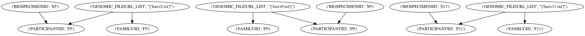

DATASET2/output.png

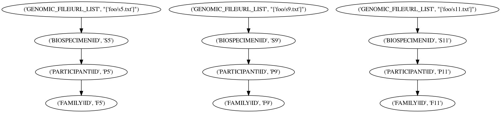


## DATASET3

```text
==========================================================================================
======================================== DATASET3 ========================================
==========================================================================================

NODE TYPE COUNTS:
	FAMILY|ID             : 2
	PARTICIPANT|ID        : 2
	BIOSPECIMEN|ID        : 1
	GENOMIC_FILE|URL_LIST : 0

Test: Each FAMILY|ID links to at least 1 PARTICIPANT|ID                         Result: ✅

~~~~~~~~~~~~~~~~~~~~~~~~~~~~~~~~~~~~~~~~~~~~~~~~~~~~~~~~~~~~~~~~~~~~~~~~~~~~~~~~~~~~~~~~~~

Test: Each PARTICIPANT|ID links to at least 1 FAMILY|ID                         Result: ✅

~~~~~~~~~~~~~~~~~~~~~~~~~~~~~~~~~~~~~~~~~~~~~~~~~~~~~~~~~~~~~~~~~~~~~~~~~~~~~~~~~~~~~~~~~~

Test: Each PARTICIPANT|ID links to at least 1 BIOSPECIMEN|ID                    Result: ❌

Error Reasons:
	('PARTICIPANT|ID', 'P2') -> []

Locations:
	('PARTICIPANT|ID', 'P2') found in ['DATASET3/fp.csv']

~~~~~~~~~~~~~~~~~~~~~~~~~~~~~~~~~~~~~~~~~~~~~~~~~~~~~~~~~~~~~~~~~~~~~~~~~~~~~~~~~~~~~~~~~~

Test: Each BIOSPECIMEN|ID links to exactly 1 PARTICIPANT|ID                     Result: ✅

~~~~~~~~~~~~~~~~~~~~~~~~~~~~~~~~~~~~~~~~~~~~~~~~~~~~~~~~~~~~~~~~~~~~~~~~~~~~~~~~~~~~~~~~~~

Test: Each BIOSPECIMEN|ID links to at least 1 GENOMIC_FILE|URL_LIST             Result: ❌

Error Reasons:
	('BIOSPECIMEN|ID', 'B1') -> []

Locations:
	('BIOSPECIMEN|ID', 'B1') found in ['DATASET3/pb.csv']

~~~~~~~~~~~~~~~~~~~~~~~~~~~~~~~~~~~~~~~~~~~~~~~~~~~~~~~~~~~~~~~~~~~~~~~~~~~~~~~~~~~~~~~~~~

Test: Each GENOMIC_FILE|URL_LIST links to exactly 1 BIOSPECIMEN|ID              Result: ⛔

~~~~~~~~~~~~~~~~~~~~~~~~~~~~~~~~~~~~~~~~~~~~~~~~~~~~~~~~~~~~~~~~~~~~~~~~~~~~~~~~~~~~~~~~~~

Test: All resolved links are direct without gaps in hierarchy                   Result: ✅
```

### Input and output images...

DATASET3/input.png

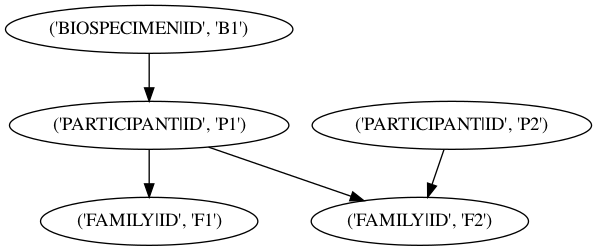

DATASET3/output.png


## DATASET4a

```text
==========================================================================================
======================================= DATASET4a ========================================
==========================================================================================

NODE TYPE COUNTS:
	FAMILY|ID             : 2
	PARTICIPANT|ID        : 2
	BIOSPECIMEN|ID        : 1
	GENOMIC_FILE|URL_LIST : 0

Test: Each FAMILY|ID links to at least 1 PARTICIPANT|ID                         Result: ✅

~~~~~~~~~~~~~~~~~~~~~~~~~~~~~~~~~~~~~~~~~~~~~~~~~~~~~~~~~~~~~~~~~~~~~~~~~~~~~~~~~~~~~~~~~~

Test: Each PARTICIPANT|ID links to at least 1 FAMILY|ID                         Result: ✅

~~~~~~~~~~~~~~~~~~~~~~~~~~~~~~~~~~~~~~~~~~~~~~~~~~~~~~~~~~~~~~~~~~~~~~~~~~~~~~~~~~~~~~~~~~

Test: Each PARTICIPANT|ID links to at least 1 BIOSPECIMEN|ID                    Result: ✅

~~~~~~~~~~~~~~~~~~~~~~~~~~~~~~~~~~~~~~~~~~~~~~~~~~~~~~~~~~~~~~~~~~~~~~~~~~~~~~~~~~~~~~~~~~

Test: Each BIOSPECIMEN|ID links to exactly 1 PARTICIPANT|ID                     Result: ❌

Error Reasons:
	('BIOSPECIMEN|ID', 'B1') -> [('PARTICIPANT|ID', 'P1'), ('PARTICIPANT|ID', 'P2')]

Locations:
	('BIOSPECIMEN|ID', 'B1') found in ['DATASET4a/fb.csv']
	('PARTICIPANT|ID', 'P1') found in ['DATASET4a/fp.csv']
	('PARTICIPANT|ID', 'P2') found in ['DATASET4a/fp.csv']

~~~~~~~~~~~~~~~~~~~~~~~~~~~~~~~~~~~~~~~~~~~~~~~~~~~~~~~~~~~~~~~~~~~~~~~~~~~~~~~~~~~~~~~~~~

Test: Each BIOSPECIMEN|ID links to at least 1 GENOMIC_FILE|URL_LIST             Result: ❌

Error Reasons:
	('BIOSPECIMEN|ID', 'B1') -> []

Locations:
	('BIOSPECIMEN|ID', 'B1') found in ['DATASET4a/fb.csv']

~~~~~~~~~~~~~~~~~~~~~~~~~~~~~~~~~~~~~~~~~~~~~~~~~~~~~~~~~~~~~~~~~~~~~~~~~~~~~~~~~~~~~~~~~~

Test: Each GENOMIC_FILE|URL_LIST links to exactly 1 BIOSPECIMEN|ID              Result: ⛔

~~~~~~~~~~~~~~~~~~~~~~~~~~~~~~~~~~~~~~~~~~~~~~~~~~~~~~~~~~~~~~~~~~~~~~~~~~~~~~~~~~~~~~~~~~

Test: All resolved links are direct without gaps in hierarchy                   Result: ✅
```

### Input and output images...

DATASET4a/input.png

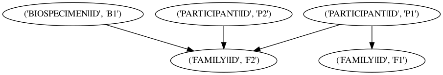

DATASET4a/output.png

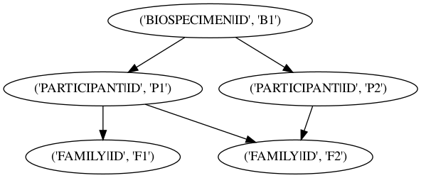


## DATASET4b

```text
==========================================================================================
======================================= DATASET4b ========================================
==========================================================================================

NODE TYPE COUNTS:
	FAMILY|ID             : 2
	PARTICIPANT|ID        : 2
	BIOSPECIMEN|ID        : 1
	GENOMIC_FILE|URL_LIST : 1

Test: Each FAMILY|ID links to at least 1 PARTICIPANT|ID                         Result: ✅

~~~~~~~~~~~~~~~~~~~~~~~~~~~~~~~~~~~~~~~~~~~~~~~~~~~~~~~~~~~~~~~~~~~~~~~~~~~~~~~~~~~~~~~~~~

Test: Each PARTICIPANT|ID links to at least 1 FAMILY|ID                         Result: ✅

~~~~~~~~~~~~~~~~~~~~~~~~~~~~~~~~~~~~~~~~~~~~~~~~~~~~~~~~~~~~~~~~~~~~~~~~~~~~~~~~~~~~~~~~~~

Test: Each PARTICIPANT|ID links to at least 1 BIOSPECIMEN|ID                    Result: ✅

~~~~~~~~~~~~~~~~~~~~~~~~~~~~~~~~~~~~~~~~~~~~~~~~~~~~~~~~~~~~~~~~~~~~~~~~~~~~~~~~~~~~~~~~~~

Test: Each BIOSPECIMEN|ID links to exactly 1 PARTICIPANT|ID                     Result: ❌

Error Reasons:
	('BIOSPECIMEN|ID', 'B1') -> [('PARTICIPANT|ID', 'P1'), ('PARTICIPANT|ID', 'P2')]

Locations:
	('BIOSPECIMEN|ID', 'B1') found in ['DATASET4b/bg.csv', 'DATASET4b/fb.csv']
	('PARTICIPANT|ID', 'P1') found in ['DATASET4b/fp.csv']
	('PARTICIPANT|ID', 'P2') found in ['DATASET4b/fp.csv']

~~~~~~~~~~~~~~~~~~~~~~~~~~~~~~~~~~~~~~~~~~~~~~~~~~~~~~~~~~~~~~~~~~~~~~~~~~~~~~~~~~~~~~~~~~

Test: Each BIOSPECIMEN|ID links to at least 1 GENOMIC_FILE|URL_LIST             Result: ✅

~~~~~~~~~~~~~~~~~~~~~~~~~~~~~~~~~~~~~~~~~~~~~~~~~~~~~~~~~~~~~~~~~~~~~~~~~~~~~~~~~~~~~~~~~~

Test: Each GENOMIC_FILE|URL_LIST links to exactly 1 BIOSPECIMEN|ID              Result: ✅

~~~~~~~~~~~~~~~~~~~~~~~~~~~~~~~~~~~~~~~~~~~~~~~~~~~~~~~~~~~~~~~~~~~~~~~~~~~~~~~~~~~~~~~~~~

Test: All resolved links are direct without gaps in hierarchy                   Result: ✅
```

### Input and output images...

DATASET4b/input.png

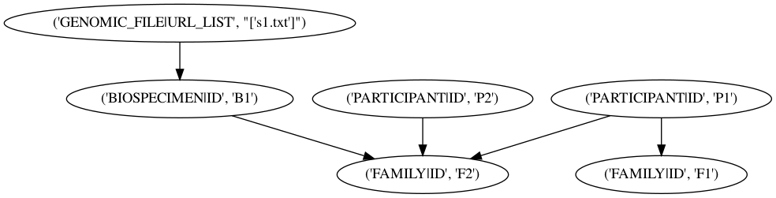

DATASET4b/output.png

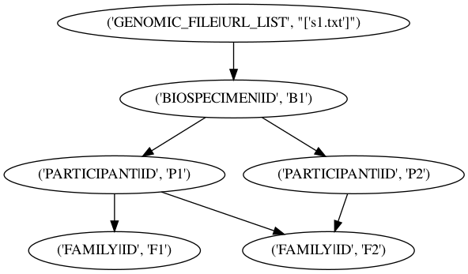


## DATASET4c

```text
==========================================================================================
======================================= DATASET4c ========================================
==========================================================================================

NODE TYPE COUNTS:
	FAMILY|ID             : 2
	PARTICIPANT|ID        : 2
	BIOSPECIMEN|ID        : 0
	GENOMIC_FILE|URL_LIST : 1

Test: Each FAMILY|ID links to at least 1 PARTICIPANT|ID                         Result: ✅

~~~~~~~~~~~~~~~~~~~~~~~~~~~~~~~~~~~~~~~~~~~~~~~~~~~~~~~~~~~~~~~~~~~~~~~~~~~~~~~~~~~~~~~~~~

Test: Each PARTICIPANT|ID links to at least 1 FAMILY|ID                         Result: ✅

~~~~~~~~~~~~~~~~~~~~~~~~~~~~~~~~~~~~~~~~~~~~~~~~~~~~~~~~~~~~~~~~~~~~~~~~~~~~~~~~~~~~~~~~~~

Test: Each PARTICIPANT|ID links to at least 1 BIOSPECIMEN|ID                    Result: ❌

Error Reasons:
	('PARTICIPANT|ID', 'P1') -> []
	('PARTICIPANT|ID', 'P2') -> []

Locations:
	('PARTICIPANT|ID', 'P1') found in ['DATASET4c/fp.csv']
	('PARTICIPANT|ID', 'P2') found in ['DATASET4c/fp.csv']

~~~~~~~~~~~~~~~~~~~~~~~~~~~~~~~~~~~~~~~~~~~~~~~~~~~~~~~~~~~~~~~~~~~~~~~~~~~~~~~~~~~~~~~~~~

Test: Each BIOSPECIMEN|ID links to exactly 1 PARTICIPANT|ID                     Result: ⛔

~~~~~~~~~~~~~~~~~~~~~~~~~~~~~~~~~~~~~~~~~~~~~~~~~~~~~~~~~~~~~~~~~~~~~~~~~~~~~~~~~~~~~~~~~~

Test: Each BIOSPECIMEN|ID links to at least 1 GENOMIC_FILE|URL_LIST             Result: ⛔

~~~~~~~~~~~~~~~~~~~~~~~~~~~~~~~~~~~~~~~~~~~~~~~~~~~~~~~~~~~~~~~~~~~~~~~~~~~~~~~~~~~~~~~~~~

Test: Each GENOMIC_FILE|URL_LIST links to exactly 1 BIOSPECIMEN|ID              Result: ❌

Error Reasons:
	('GENOMIC_FILE|URL_LIST', "['s1.txt']") -> []

Locations:
	('GENOMIC_FILE|URL_LIST', "['s1.txt']") found in ['DATASET4c/fg.csv']

~~~~~~~~~~~~~~~~~~~~~~~~~~~~~~~~~~~~~~~~~~~~~~~~~~~~~~~~~~~~~~~~~~~~~~~~~~~~~~~~~~~~~~~~~~

Test: All resolved links are direct without gaps in hierarchy                   Result: ❌

Error Reasons:
	('GENOMIC_FILE|URL_LIST', "['s1.txt']") -> [('PARTICIPANT|ID', 'P2'), ('PARTICIPANT|ID', 'P1')]

Locations:
	('GENOMIC_FILE|URL_LIST', "['s1.txt']") found in ['DATASET4c/fg.csv']
	('PARTICIPANT|ID', 'P1') found in ['DATASET4c/fp.csv']
	('PARTICIPANT|ID', 'P2') found in ['DATASET4c/fp.csv']
```

### Input and output images...

DATASET4c/input.png

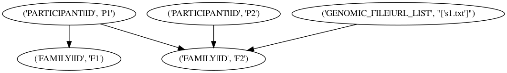

DATASET4c/output.png

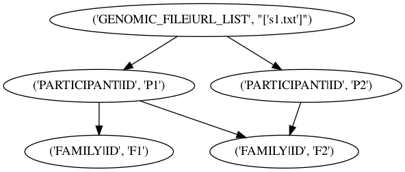


## DATASET4d

```text
==========================================================================================
======================================= DATASET4d ========================================
==========================================================================================

NODE TYPE COUNTS:
	FAMILY|ID             : 2
	PARTICIPANT|ID        : 2
	BIOSPECIMEN|ID        : 1
	GENOMIC_FILE|URL_LIST : 1

Test: Each FAMILY|ID links to at least 1 PARTICIPANT|ID                         Result: ✅

~~~~~~~~~~~~~~~~~~~~~~~~~~~~~~~~~~~~~~~~~~~~~~~~~~~~~~~~~~~~~~~~~~~~~~~~~~~~~~~~~~~~~~~~~~

Test: Each PARTICIPANT|ID links to at least 1 FAMILY|ID                         Result: ✅

~~~~~~~~~~~~~~~~~~~~~~~~~~~~~~~~~~~~~~~~~~~~~~~~~~~~~~~~~~~~~~~~~~~~~~~~~~~~~~~~~~~~~~~~~~

Test: Each PARTICIPANT|ID links to at least 1 BIOSPECIMEN|ID                    Result: ✅

~~~~~~~~~~~~~~~~~~~~~~~~~~~~~~~~~~~~~~~~~~~~~~~~~~~~~~~~~~~~~~~~~~~~~~~~~~~~~~~~~~~~~~~~~~

Test: Each BIOSPECIMEN|ID links to exactly 1 PARTICIPANT|ID                     Result: ❌

Error Reasons:
	('BIOSPECIMEN|ID', 'B1') -> [('PARTICIPANT|ID', 'P1'), ('PARTICIPANT|ID', 'P2')]

Locations:
	('BIOSPECIMEN|ID', 'B1') found in ['DATASET4d/pb.csv']
	('PARTICIPANT|ID', 'P1') found in ['DATASET4d/pb.csv', 'DATASET4d/fp.csv']
	('PARTICIPANT|ID', 'P2') found in ['DATASET4d/fp.csv']

~~~~~~~~~~~~~~~~~~~~~~~~~~~~~~~~~~~~~~~~~~~~~~~~~~~~~~~~~~~~~~~~~~~~~~~~~~~~~~~~~~~~~~~~~~

Test: Each BIOSPECIMEN|ID links to at least 1 GENOMIC_FILE|URL_LIST             Result: ✅

~~~~~~~~~~~~~~~~~~~~~~~~~~~~~~~~~~~~~~~~~~~~~~~~~~~~~~~~~~~~~~~~~~~~~~~~~~~~~~~~~~~~~~~~~~

Test: Each GENOMIC_FILE|URL_LIST links to exactly 1 BIOSPECIMEN|ID              Result: ✅

~~~~~~~~~~~~~~~~~~~~~~~~~~~~~~~~~~~~~~~~~~~~~~~~~~~~~~~~~~~~~~~~~~~~~~~~~~~~~~~~~~~~~~~~~~

Test: All resolved links are direct without gaps in hierarchy                   Result: ✅
```

### Input and output images...

DATASET4d/input.png

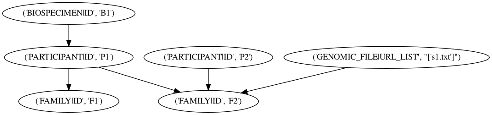

DATASET4d/output.png


## DATASET4e

```text
==========================================================================================
======================================= DATASET4e ========================================
==========================================================================================

NODE TYPE COUNTS:
	FAMILY|ID             : 2
	PARTICIPANT|ID        : 2
	BIOSPECIMEN|ID        : 1
	GENOMIC_FILE|URL_LIST : 1

Test: Each FAMILY|ID links to at least 1 PARTICIPANT|ID                         Result: ✅

~~~~~~~~~~~~~~~~~~~~~~~~~~~~~~~~~~~~~~~~~~~~~~~~~~~~~~~~~~~~~~~~~~~~~~~~~~~~~~~~~~~~~~~~~~

Test: Each PARTICIPANT|ID links to at least 1 FAMILY|ID                         Result: ✅

~~~~~~~~~~~~~~~~~~~~~~~~~~~~~~~~~~~~~~~~~~~~~~~~~~~~~~~~~~~~~~~~~~~~~~~~~~~~~~~~~~~~~~~~~~

Test: Each PARTICIPANT|ID links to at least 1 BIOSPECIMEN|ID                    Result: ❌

Error Reasons:
	('PARTICIPANT|ID', 'P2') -> []

Locations:
	('PARTICIPANT|ID', 'P2') found in ['DATASET4e/pg.csv', 'DATASET4e/fp.csv']

~~~~~~~~~~~~~~~~~~~~~~~~~~~~~~~~~~~~~~~~~~~~~~~~~~~~~~~~~~~~~~~~~~~~~~~~~~~~~~~~~~~~~~~~~~

Test: Each BIOSPECIMEN|ID links to exactly 1 PARTICIPANT|ID                     Result: ✅

~~~~~~~~~~~~~~~~~~~~~~~~~~~~~~~~~~~~~~~~~~~~~~~~~~~~~~~~~~~~~~~~~~~~~~~~~~~~~~~~~~~~~~~~~~

Test: Each BIOSPECIMEN|ID links to at least 1 GENOMIC_FILE|URL_LIST             Result: ❌

Error Reasons:
	('BIOSPECIMEN|ID', 'B1') -> []

Locations:
	('BIOSPECIMEN|ID', 'B1') found in ['DATASET4e/pb.csv']

~~~~~~~~~~~~~~~~~~~~~~~~~~~~~~~~~~~~~~~~~~~~~~~~~~~~~~~~~~~~~~~~~~~~~~~~~~~~~~~~~~~~~~~~~~

Test: Each GENOMIC_FILE|URL_LIST links to exactly 1 BIOSPECIMEN|ID              Result: ❌

Error Reasons:
	('GENOMIC_FILE|URL_LIST', "['s1.txt']") -> []

Locations:
	('GENOMIC_FILE|URL_LIST', "['s1.txt']") found in ['DATASET4e/pg.csv']

~~~~~~~~~~~~~~~~~~~~~~~~~~~~~~~~~~~~~~~~~~~~~~~~~~~~~~~~~~~~~~~~~~~~~~~~~~~~~~~~~~~~~~~~~~

Test: All resolved links are direct without gaps in hierarchy                   Result: ❌

Error Reasons:
	('GENOMIC_FILE|URL_LIST', "['s1.txt']") -> [('PARTICIPANT|ID', 'P2')]

Locations:
	('GENOMIC_FILE|URL_LIST', "['s1.txt']") found in ['DATASET4e/pg.csv']
	('PARTICIPANT|ID', 'P2') found in ['DATASET4e/pg.csv', 'DATASET4e/fp.csv']
```

### Input and output images...

DATASET4e/input.png

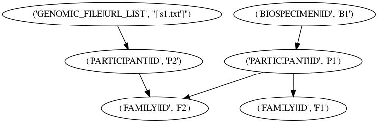

DATASET4e/output.png


## DATASET5

```text
==========================================================================================
======================================== DATASET5 ========================================
==========================================================================================

NODE TYPE COUNTS:
	FAMILY|ID             : 2
	PARTICIPANT|ID        : 1
	BIOSPECIMEN|ID        : 2
	GENOMIC_FILE|URL_LIST : 0

Test: Each FAMILY|ID links to at least 1 PARTICIPANT|ID                         Result: ✅

~~~~~~~~~~~~~~~~~~~~~~~~~~~~~~~~~~~~~~~~~~~~~~~~~~~~~~~~~~~~~~~~~~~~~~~~~~~~~~~~~~~~~~~~~~

Test: Each PARTICIPANT|ID links to at least 1 FAMILY|ID                         Result: ✅

~~~~~~~~~~~~~~~~~~~~~~~~~~~~~~~~~~~~~~~~~~~~~~~~~~~~~~~~~~~~~~~~~~~~~~~~~~~~~~~~~~~~~~~~~~

Test: Each PARTICIPANT|ID links to at least 1 BIOSPECIMEN|ID                    Result: ✅

~~~~~~~~~~~~~~~~~~~~~~~~~~~~~~~~~~~~~~~~~~~~~~~~~~~~~~~~~~~~~~~~~~~~~~~~~~~~~~~~~~~~~~~~~~

Test: Each BIOSPECIMEN|ID links to exactly 1 PARTICIPANT|ID                     Result: ✅

~~~~~~~~~~~~~~~~~~~~~~~~~~~~~~~~~~~~~~~~~~~~~~~~~~~~~~~~~~~~~~~~~~~~~~~~~~~~~~~~~~~~~~~~~~

Test: Each BIOSPECIMEN|ID links to at least 1 GENOMIC_FILE|URL_LIST             Result: ❌

Error Reasons:
	('BIOSPECIMEN|ID', 'B1') -> []
	('BIOSPECIMEN|ID', 'B2') -> []

Locations:
	('BIOSPECIMEN|ID', 'B1') found in ['DATASET5/pb.csv', 'DATASET5/fb.csv']
	('BIOSPECIMEN|ID', 'B2') found in ['DATASET5/fb.csv']

~~~~~~~~~~~~~~~~~~~~~~~~~~~~~~~~~~~~~~~~~~~~~~~~~~~~~~~~~~~~~~~~~~~~~~~~~~~~~~~~~~~~~~~~~~

Test: Each GENOMIC_FILE|URL_LIST links to exactly 1 BIOSPECIMEN|ID              Result: ⛔

~~~~~~~~~~~~~~~~~~~~~~~~~~~~~~~~~~~~~~~~~~~~~~~~~~~~~~~~~~~~~~~~~~~~~~~~~~~~~~~~~~~~~~~~~~

Test: All resolved links are direct without gaps in hierarchy                   Result: ✅
```

### Input and output images...

DATASET5/input.png

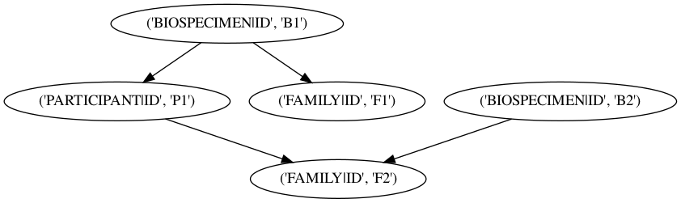

DATASET5/output.png

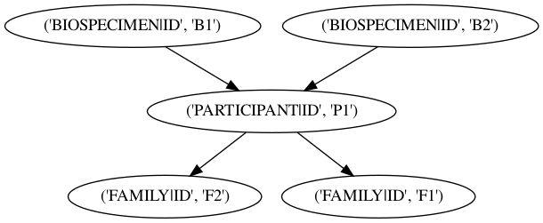


## DATASET6

```text
==========================================================================================
======================================== DATASET6 ========================================
==========================================================================================

NODE TYPE COUNTS:
	FAMILY|ID             : 1
	PARTICIPANT|ID        : 1
	BIOSPECIMEN|ID        : 2
	GENOMIC_FILE|URL_LIST : 0

Test: Each FAMILY|ID links to at least 1 PARTICIPANT|ID                         Result: ✅

~~~~~~~~~~~~~~~~~~~~~~~~~~~~~~~~~~~~~~~~~~~~~~~~~~~~~~~~~~~~~~~~~~~~~~~~~~~~~~~~~~~~~~~~~~

Test: Each PARTICIPANT|ID links to at least 1 FAMILY|ID                         Result: ✅

~~~~~~~~~~~~~~~~~~~~~~~~~~~~~~~~~~~~~~~~~~~~~~~~~~~~~~~~~~~~~~~~~~~~~~~~~~~~~~~~~~~~~~~~~~

Test: Each PARTICIPANT|ID links to at least 1 BIOSPECIMEN|ID                    Result: ✅

~~~~~~~~~~~~~~~~~~~~~~~~~~~~~~~~~~~~~~~~~~~~~~~~~~~~~~~~~~~~~~~~~~~~~~~~~~~~~~~~~~~~~~~~~~

Test: Each BIOSPECIMEN|ID links to exactly 1 PARTICIPANT|ID                     Result: ✅

~~~~~~~~~~~~~~~~~~~~~~~~~~~~~~~~~~~~~~~~~~~~~~~~~~~~~~~~~~~~~~~~~~~~~~~~~~~~~~~~~~~~~~~~~~

Test: Each BIOSPECIMEN|ID links to at least 1 GENOMIC_FILE|URL_LIST             Result: ❌

Error Reasons:
	('BIOSPECIMEN|ID', 'B1') -> []
	('BIOSPECIMEN|ID', 'B2') -> []

Locations:
	('BIOSPECIMEN|ID', 'B1') found in ['DATASET6/fb.csv']
	('BIOSPECIMEN|ID', 'B2') found in ['DATASET6/fb.csv', 'DATASET6/fp.csv']

~~~~~~~~~~~~~~~~~~~~~~~~~~~~~~~~~~~~~~~~~~~~~~~~~~~~~~~~~~~~~~~~~~~~~~~~~~~~~~~~~~~~~~~~~~

Test: Each GENOMIC_FILE|URL_LIST links to exactly 1 BIOSPECIMEN|ID              Result: ⛔

~~~~~~~~~~~~~~~~~~~~~~~~~~~~~~~~~~~~~~~~~~~~~~~~~~~~~~~~~~~~~~~~~~~~~~~~~~~~~~~~~~~~~~~~~~

Test: All resolved links are direct without gaps in hierarchy                   Result: ✅
```

### Input and output images...

DATASET6/input.png

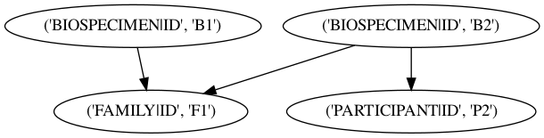

DATASET6/output.png

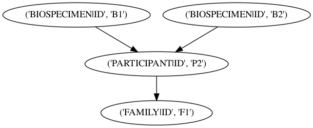
