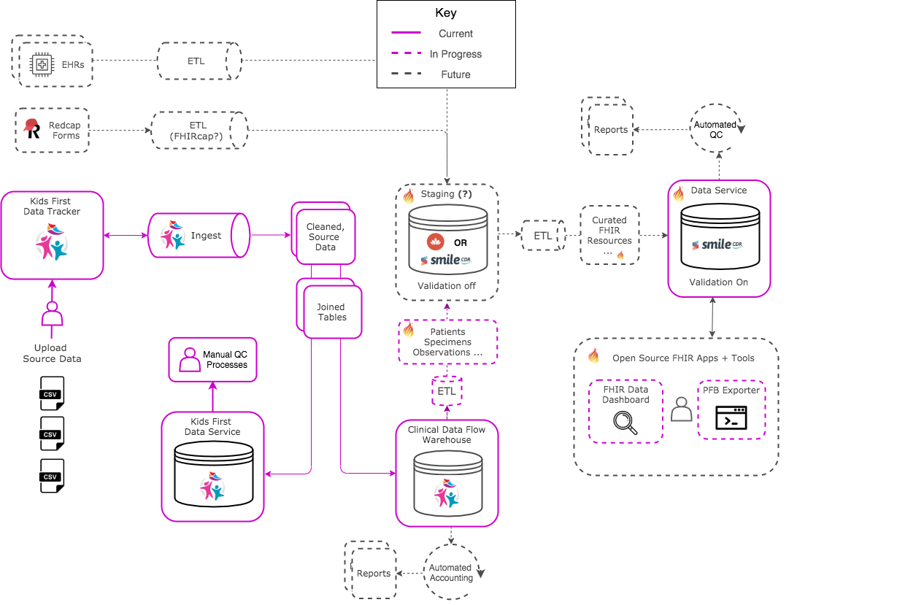

  

  

# Clinical Data Flow
Project management and design artifacts for [Clinical Data Flow](https://d3b.io/docs/products/clinical-data-flow) product

## Evolving Architecture
[Draw.io Source](https://drive.google.com/file/d/1xdtljwZ2FjFVxJD4tPRbP1QWk2j1eE3d/view?usp=sharing)

### Components

- [Data Ingest Library](https://github.com/kids-first/kf-lib-data-ingest)
- RedCap to FHIR (FHIR Cap) - TBD
- [Ingest Warehouse](warehouse/README.md)
- FHIR Staging Service - TBD
- [FHIR Data Service](https://github.com/kids-first/kf-api-fhir-service)
- [FHIR Data Model](https://github.com/kids-first/kf-model-fhir)
- [FHIR Data Dashboard](https://github.com/kids-first/kf-ui-fhir-data-dashboard)

