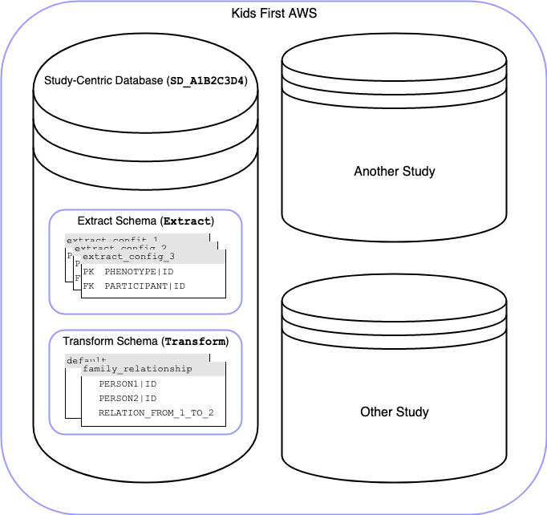

# ⛳️ Playground Clinical Data Flow Warehouse

Temporary data warehouse for development purposes. This will later go away
in favor of the D3b Data Warehouse.

## Quickstart

The warehouse and Metabase are deployed in the Kids First AWS Dev environment.
You must tunnel into this environment in order to access the endpoints.

### Setup Tunnel to Dev Env

Create a tunnel to the dev environment so that you can access the db:

```shell
$ ./dev-env-tunnel.sh dev
```
Get [dev-env-tunnel.sh](https://github.com/kids-first/aws-infra-toolbox/blob/master/scripts/developer_scripts/dev-env-tunnel)

### Endpoints

- **Warehouse DB:** http://10.10.1.191:5431
- **Metabase App:** http://10.10.1.191:3000

## Spin Up Docker Stack

If you want to work locally, spin up a Docker container on your machine

```bash
git clone git@github.com:d3b-center/clinical-data-flow.git
cd clinical-data-flow/warehouse

# Rename smilecdr/dev.env to smilecdr/.env so docker-compose
# can pick up the environment variables at runtime
mv dev.env .env

docker-compose up -d
```

Then use any db client to connect to `localhost:5431` using the db credentials
in `.env`.

## Data Organization

This warehouse currently stores the cleaned and merged source data from Kids First studies which have been ingested using the ingest [library](https://github.com/kids-first/kf-lib-data-ingest) and [packages](https://github.com/kids-first/kf-ingest-packages).

The cleaned source data tables are produced by ingest library's extract stage and the merged data tables are produced by the library's transform stage. 

Any column name in any of these tables will be a concept attribute from the library's [standard concept schema](https://github.com/kids-first/kf-lib-data-ingest/blob/master/kf_lib_data_ingest/common/concept_schema.py).
Upon ingest of a study, a new database named after the study's KF ID will be created with two schemas: 1) `Extract` and 2) `Transform`. The below figure illustrates the organization of ingested data:

[Draw.io Source](https://drive.google.com/file/d/1IJGg6Dw9TeNzLzI-9fnUvo71Y6HL8UHN/view)



### `Extract` Schema

The `Extract` namespace stores extract stage output table(s) where table name(s) are set to extract config file name(s) without the file extension. For example, the following SQL statement will select all rows from an extract stage output table produced by the ingest library using the extract config called `participants.py`: 

```sql
SELECT * FROM "Extract"."participants";
```

### `Transform` Schema

The `Transform` namespace stores transform stage output table(s) where table name(s) are set to a key name in the Python dictionary declared at the end of the transform module (`transform_module.py`). 

For example, if the transform module outputs the following Python dict:

```python
{
    "default": <Pandas DataFrame>,
    "family-relationship": <Pandas DataFrame>
}
```

Then, the following SQL statement will select all rows from the transform output table with the key name `default`:

```sql
SELECT * FROM "Transform"."default";
```
